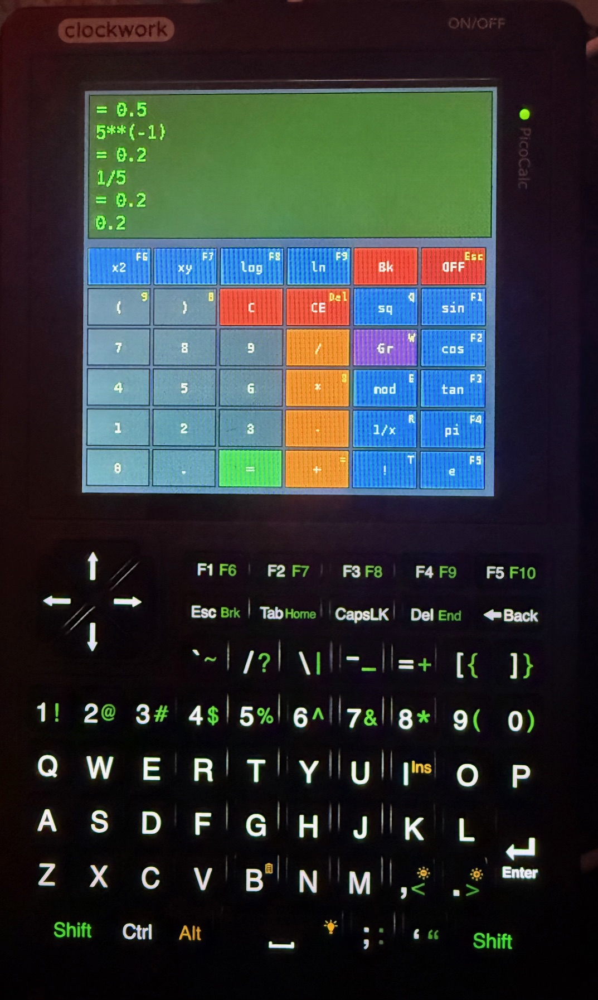
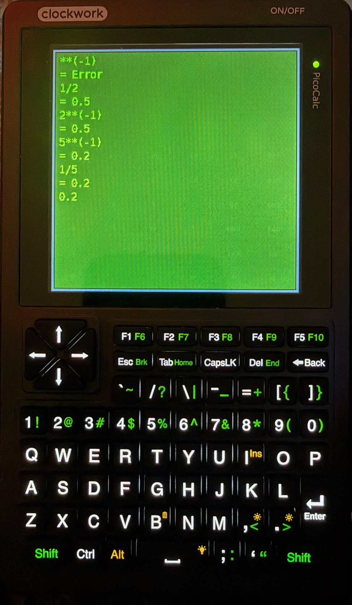

# SDL_Calc
Python SDL calculator for Clockwork PicoCalc using Luckfox Lyra.

This code is supplied as is, no warranty.

For personnal use only.

### Hotkey basics

Short press: Key pressed and released in under 500 ms. Triggers the primary action.

Long press: Key held for more than 500 ms. Triggers the alternate action where defined.

Repeat suppression: Auto-repeat while key is held is ignored to prevent duplicate inputs.

Error recovery: After “= Error”, typing a digit or pressing a numeric hotkey starts a fresh expression.

Fullscreen toggle: Space switches between normal UI (display + buttons) and full display mode; history view auto-scrolls to keep the active input line visible when returning to normal mode.

Hint overlay: On-screen yellow labels show hotkeys in the top-right of each button. Toggle with H.

### Global toggles and overlays

H (short): Toggle the hotkey overlay (on-screen yellow labels on buttons).

I (short): Toggle a centered light-grey info panel with information notice.

Space (short): Toggle fullscreen display mode. In fullscreen, only the display area is shown; in normal mode, buttons are visible again.

Esc (short): Quit via the OFF button mapping.

### Calculation control

Enter/Return (short): Evaluate the current expression.

Del (short): Clear Everything (history and current expression).

Backspace (short): Delete one character from the current expression.

C (short): Step-undo of the last input token. A “step” is: a full function prefix like “sin(”, “cos(”, “tan(”, “sqrt(”, “log10(”, “log(”; a complete number including its fractional part; a single operator; a parenthesis “(” or “)”; a factorial “!”. Repeats go back step-by-step until the line is empty.

### Numeric and operator keys

0–9 (short): Append digit. If the previous result was just computed or an error occurred, starts a new expression with that digit.

. (short): Append decimal point.

= (short): Evaluate expression.

= (long): Insert plus “+”.

8 (long): Insert multiply “*”.

9 (long): Insert open parenthesis “(”.

0 (long): Insert close parenthesis “)”.

6 (long): Insert caret “^” for power; evaluation converts “^” to Python “**”.

+, -, *, /, . (short): Append operator or dot directly when typed from keyboard.

Modulo mapping: E (short) inserts “%”.

Reciprocal mapping: R (short) inserts “**(-1)” (for 1/x).

Factorial mapping: T (short) inserts “!”.

Function hotkeys (short vs long press)

F1: short → insert “sin(”; long → insert “sqrt(”.

F2: short → insert “cos(”; long → insert “**2” (square).

F3: short → insert “tan(”; long → insert “log10(”.

F4: short → insert π (3.14159…); long → insert “log(”.

F5: short → insert e (2.71828…).

F6: short → insert “**2”.

F7: short → insert “**”.

F8: short → insert “log10(”.

F9: short → insert “log(”.

### Quick-access letter hotkeys

Q (short): Insert square root “sqrt(”.

W (short): Toggle Graph mode on/off.

E (short): Insert modulo operator “%” (same as “mod” button).

R (short): Insert “**(-1)” (reciprocal, same as “1/x”).

T (short): Insert factorial “!”.

H (short): Toggle hotkey overlay.

I (short): Toggle info panel.

### Parentheses and power entry patterns

9 long press: Insert “(” without moving hands to shift.

0 long press: Insert “)”.

6 long press: Insert “^” quickly for power; on evaluation, “^” is converted to “**”.

x2 button or F2 long or F6 short: Insert “**2” (square).

xy button or F7 short: Insert “” followed by exponent digits. Example: type “2”, press F7, then “3” to get 23.

### Constants

F4 short: Insert π. If a result was just shown or after error, starts a new expression with π; otherwise appends π.

F5 short: Insert e. Same start-new vs append behavior as π.

### Graph mode

W (short): Toggle Graph mode. When active, this mode flag is toggled; drawing logic can use it to switch to graph rendering as configured.

OFF and clears

Esc or clicking OFF: Exit the app immediately.

CE/Del: Clear Everything (history + current input).

C (button): Clear current input only. Note: keyboard C is undo-step; the CE and C buttons are available on-screen.

On-screen hotkey overlay labels (shown by default, toggle with H)

OFF: “Esc”

CE: “Del”

sin: “F1”

cos: “F2”

tan: “F3”

pi: “F4”

e: “F5”

x2: “F6”

xy: “F7”

log: “F8”

ln: “F9”

*: “8”

+: “=”

(: “9”

): “0”

sq: “Q”

Gr: “W”

mod: “E”

1/x: “R”

!: “T”

### Notes on evaluation

Factorials: Only plain integer factorials like “5!” are expanded before evaluation.

Powers: “^” is translated to “**” at evaluation time so inputs like “2^2” yield 4.

Integers vs floats: Results that are mathematically integral are shown without decimal; other results are rounded to 10 decimals.

Error state: On error, history records the expression and “= Error”, the input is cleared, and the next digit or numeric hotkey starts fresh.
